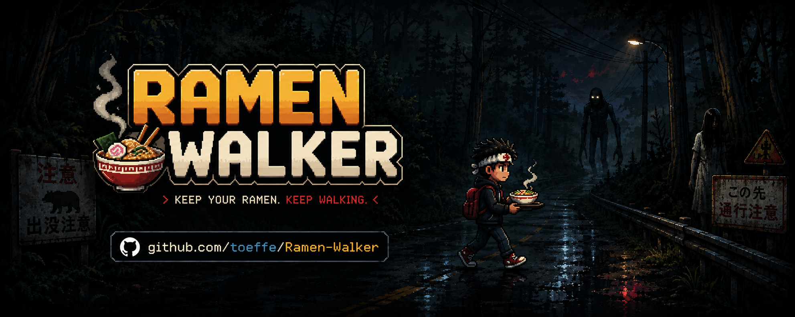

<p align="center">
  
</p>

> *A random "scary" game about a player who just wants to get home with his favorite ramen.*

**Play it now:** [scary.toeffe.uk](https://scary.toeffe.uk/)

---

## 🎮 About the Game

You are carrying dinner down a road that does not want you to finish. Keep the bowl on the tray. Do not look back.

**Ramen Walker** is a short atmospheric horror experience built around a simple, tense premise: balance your ramen bowl on a tray while walking home through an increasingly hostile environment. The tension builds as you struggle to keep your meal intact — and your nerves steady.

---

## 🕹️ Controls

| Key | Action |
|-----|--------|
| **W A S D** | Walk |
| **Mouse Left / Right** | Keep the bowl balanced on the tray |
| **Hold Left Click** | Look around |
| **Shift** | Hurry *(not recommended)* |

---

## 🛠️ Tech Stack

- Built with web technologies (HTML5 / JavaScript / WebGL)
- Hosted at [scary.toeffe.uk](https://scary.toeffe.uk/)

---

## 🚀 Getting Started

### Play Online
Simply visit **[scary.toeffe.uk](https://scary.toeffe.uk/)** to play directly in your browser.

### Run Locally
```bash
# Clone the repository
git clone https://github.com/toeffe/Ramen-Walker.git

# Navigate into the project
cd Ramen-Walker

# Serve the files (e.g., using Python's built-in server)
python -m http.server 8000

# Open in your browser
# http://localhost:8000
```

---

## 📁 Project Structure

```
Ramen-Walker/
├── index.html          # Main game entry point
├── assets/             # Game assets (images, audio, models)
├── js/                 # Game logic & mechanics
├── css/                # Styling
└── README.md           # This file
```

---

## 🎯 Gameplay Tips

- **Balance is everything** — small, gentle mouse movements keep the bowl steady.
- **Don't rush** — Shift makes you faster, but also far more unstable.
- **Resist the urge to look back** — the road has a way of punishing curiosity.

---

## 📝 License

This project is open source. See the repository for license details.

---

## 👤 Author

Made with 🍜 by **[toeffe](https://github.com/toeffe)**

---

*Keep the bowl on the tray.*